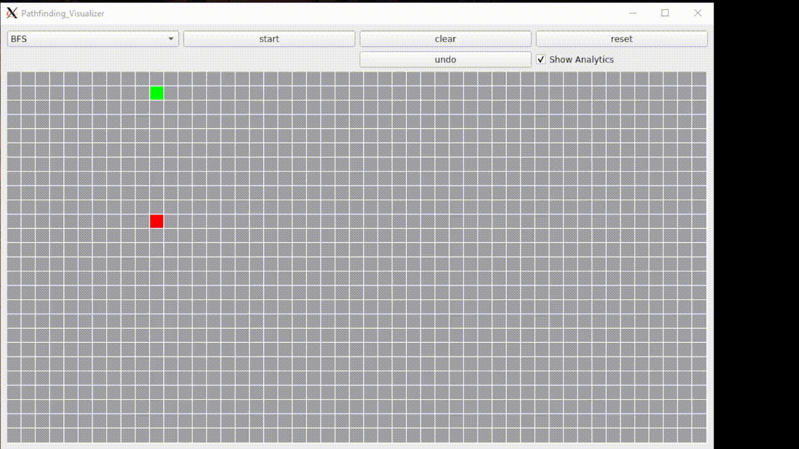

# Pathfinding Visualizer

simple pathfinding visualizer written in C++ using Qt5

# Install and Run

- install qt5 
- in terminal window:
~~~
cd ~/project_dir/
qmake -project
qmake Pathfinding_Visualizer.pro
make
./Pathfinding_Visualizer
~~~

if you are on Ubuntu
- in terminal window:
~~~
cd ~/project_dir/
chmod +x install_ubuntu.sh
./install_ubuntu.sh
./Pathfinding_Visualizer
~~~

# TODOs
- functionality to erase walls
- more algorithms
